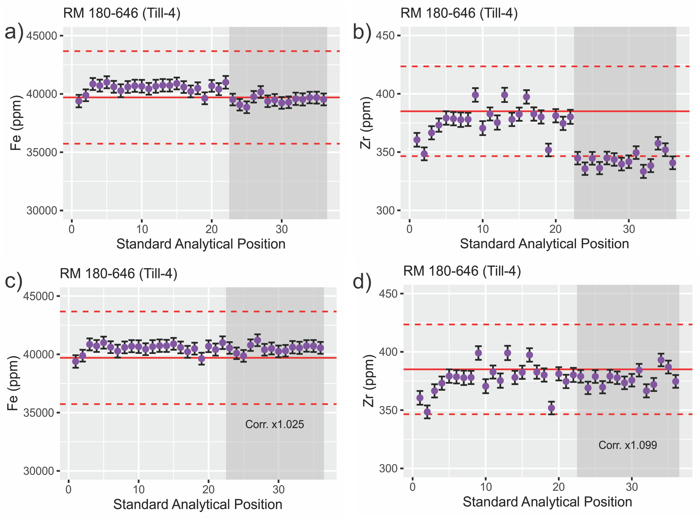
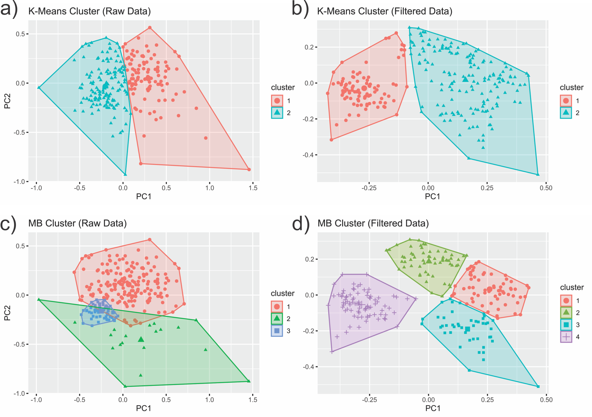

# K-Means and Model-Based Clustering in raw and filtered pXRF data

This code is part of the preprint "Model-Based Clustering for unsupervised drill core pseudo-log generation and comparison with K-Means in raw and filtered data" written by researchers of the Directory of Geology and Mineral Resources from the [Geological Survey of Brazil – CPRM](https://www.cprm.gov.br/en/).

It was developed in R Language, using the RStudio Enviroment with [Tidyverse set of packages](https://www.tidyverse.org/) and statiscal packages [Corrplot](https://www.rdocumentation.org/packages/corrplot/versions/0.84) and [Factoextra](https://www.rdocumentation.org/packages/factoextra/versions/1.0.3) por quantitative analysis.

# Code
Code is  divided in two scripts available in the [Code_R directory](Code_R). In [Salitre_QAQC script](Code_R/Salitre_QAQC.R), we present the pre-processing step and the correction of a translational bias based on CRM analysis. 

Figure 1: Shewhart control chart (Piercey, 2014) for measurements on RM 180-646. Identification of the translational bias for a) Fe and b) Zr, and values corrected c) and d) for the same elements.

In [Salitre script](Code_R/Salitre.R), we present the data processing after the QAQC procedures, including statistical tests (Kruskal and Wallis, 1952; Shapiro and Wilk, 1965), exploration data analysis, Exponential Moving Average filtering, Principal Components Analysis, K-Means and Model-Based Clustering analysis and tunning.

Figure 2: Bivariate plot of the first and second dimensions of PCA with the position of each sample and the respective cluster classification. K-Means for clustering for a) raw and b) filtered data; MB clustering for c) raw and d) filtered data, respectively.

## Required Packages
``` R
library(tidyverse) # ggplot, dplyr, readr, tibble, readr
library(hrbrthemes) # Color palletes and themes
library(Cairo) # Export Plots
library(TTR) # Exponential Movel Average
library(corrplot) # Correlation analysis
library(factoextra) # K-Means Clustering and PCA
library(mclust) # Model-Based Clustering
library(janitor) #Dates and times in the excel notation
```


# Abstract

In this study, we use in situ portable X-Ray Fluorescence data acquired in sawn drill core samples of supracrustal rocks from the Rio Salitre Greenstone Belt for automatic generation of the pseudo-log through running unsupervised learning models to group distinct lithotypes. We tested K-Means and Model-Based Cluster (MBC) methods and compared their performance in raw and filtered data with a manual macroscopic log description. From the initial 47 available elements, 20 variables were selected for modeling following the criterion of presenting, at least, 95% of uncensored values. Then, we ran a Shapiro-Wilk test that confirmed a non-parametric distribution by the verification of the P-Value attribute less than the 5% significance level. After this step, we checked if the distribution of the dataset was statistically equivalent to the duplicates with the assistance of a Kruskal-Walis test, which would confirm the representativity power of the measurements at the same 5% significance level. Then, the pseudo-log models were created based on data with reduced dimension, compressed by a centered Principal Component Analysis with data rescaled by its range, which does not change the original distribution. Aiming to reduce the high-frequency noise in the selected features, we ran an exponential weighted moving average (EWMA) filter with a window of five samples. By the analysis of the Average Silhouette Width on sample space, the optimum number for K-Means was fixed in two, and then the first models were generated for raw and filtered data. At the MBC perspective, the sample space is interpreted as a finite mixture of groups with distinct Gaussian probability distribution. The number of clusters is defined by the analysis of the Bayesian Information Criteria (BIC), where several models are tested, and the one in the first local maximum defines the number of groups and the type of probabilistic model in the simulation. For the data used in this work, the optimum group number for MBC is four, and the probabilistic model type determined by the BIC is elliptical with equal volume, shape, and orientation, what can be interpreted that the Model-Based Cluster has detected four different lithotypes with almost the same representativity for the sample space of the two drill cores. All K-Means and MBC models were able to detect changes in lithotypes not described in the manual log. On the other hand, one lithotype described by the experts was not detected by this methodology in any of the attempts. At last, in comparison with the manual log description, it is notable that the models built on filtered data have better performance than those generated on raw data, and the MBC filtered model had the better performance of all. Hence, this multivariate approach allied to filtering the data with a moving average transformation can be a tool of great help during several stages of mineral exploration, either in the creation of pseudo-log models prior the description of the drill core samples or in the data validation stage, when it is necessary to standardize several descriptions made by different professionals.

## Keywords
Clustering comparison, Portable X-Ray Fluorescence, Unsupervised Learning

## Paper authors:
```
Guilherme Ferreira da Silva
João Henrique Larizzatti
Anderson Dourado Rodrigues Silva
Carina Graciniana Lopes
Evandro Luiz Klein
Kotaro Uchigasaki
```

## Code author:
[Guilherme Ferreira da Silva](https://www.researchgate.net/profile/Guilherme_Silva26), (E-mail: guilherme.ferreira@cprm.gov.br)

## Acknowledgements

Many thanks to [Marcos Vinícius Ferreira](https://github.com/marcosbr) for the code revising.

# REFERENCES
## Papers
Kruskal, William H.; Wallis, W. Allen (1 de dezembro de 1952). Use of Ranks in One-Criterion Variance Analysis. Journal of the American Statistical Association. 47 (260): 583–621. ISSN 0162-1459. doi:10.1080/01621459.1952.10483441

Piercey, S.J., 2014. Modern analytical facilities 2. A review of quality assurance and quality control (qa/qc) procedures for lithogeochemical data. Geosci. Canada 41, 75–88. https://doi.org/10.12789/geocanj.2014.41.035

Shapiro, S. S.; Wilk, M. B. (1965). An analysis of variance test for normality (complete samples). Biometrika. 52 (3–4): 591–611. doi:10.1093/biomet/52.3-4.591. JSTOR 2333709. MR 0205384. p. 593

## Websites
Correlation Matrix
http://www.sthda.com/english/wiki/visualize-correlation-matrix-using-correlogram

PCA
https://towardsdatascience.com/dimensionality-reduction-does-pca-really-improve-classification-outcome-6e9ba21f0a32

PCA for Machine Learning
https://medium.com/apprentice-journal/pca-application-in-machine-learning-4827c07a61db

K-Means Clustering
https://uc-r.github.io/kmeans_clustering
